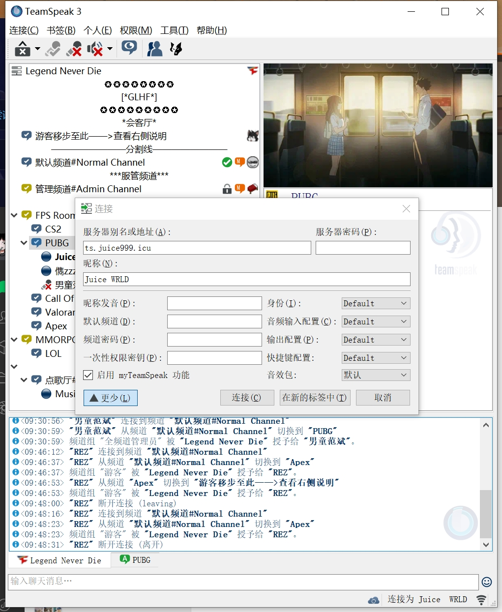

# 介绍
在kook越来越差的用户体验下，越来越多的游戏用户将眼光投向了各类语音软件竞品。例如最近大热的oopz或黑盒语音。其中Teamspeak3作为老牌语音软件，
因为其用户量少而不为人熟知，但这不影响他的优秀性能和品质。


TeamSpeak 是一款 VoIP 语言通话软件，使用者可以用耳机和麦克风，通过客户端软件连线到指定的服务器，与在服务器内频道的其他使用者进行通话。是一种很像电话会议的方式。 通常 TeamSpeak 的使用者大多为多人连线游戏的玩家，与同队伍的玩家进行通讯。在游戏的对战方面，具有低内存占用、低延迟(服务器地区周围的用户低至个位数延迟<10ms>)、高清晰度、高可靠性等优点，是一种非常好的游戏交流方式。

## 为什不用YY和Kook
首先，先说一下广告方面，用过 YY 的用户可能都知道上面满屏幕的广告，但是 TeamSpeak 和 Discord 并没有广告。

其次，捆绑软件方面，Discord没有捆绑， TeamSpeak 在安装时会询问是否安装 Overwolf (可选项，此软件为游戏内覆盖层，可在游戏内查看当前说话的用户)，而安装 YY 后，同时会捆绑 YY浏览器等软件。
第三，YY 并不支持感应麦，即达到一定分贝才会录入。
另外，不知道是否还有人记得，在17年年底的某会期间，YY屏蔽了海外用户的登陆。这一条也是我的一部分朋友转战 TeamSpeak 的原因。


# 下载

首先，我们需要下载 TeamSpeak 客户端，以便于您可以连接到服务器。您可以在这里下载 TeamSpeak 客户端安装包。
```
https://edisonjwa.lanzoux.com/ibyHjisyeuj
```

安装完成本体后，软件是非中文的。这里可以下载汉化包
```
https://dl.tmspk.wiki/https:/github.com/VigorousPro/TS3-Translation_zh-CN/releases/download/snapshot/Chinese_Translation_zh-CN.ts3_translation
```

# 使用

在您安装好 TeamSpeak 客户端后，打开 Connections (连接) 菜单，点击 Connect (连接) 按钮，打开连接窗口。

填写您要连接的服务器地址，和您的用户名，点击 Connect (连接) 按钮，即可连接至服务器。



## 进阶设置
一般来说，您在连接至服务器后，您应该可以与其他用户进行交流。但是，我们仍然建议您进行一些进阶设置，以确保您可以正常使用 TeamSpeak。

音频输入设置
点击 Tools (工具) 菜单，点击 Options (选项) 按钮，打开选项窗口。

在页面左侧，点击 Capture (音频输入) 选项卡，打开音频输入设置页面。 您将会看到如下的默认设置。


将语音检测模式修改为 Volume Gate 后，点击 开始测试 按钮，在下方的音量条中，您可以看到您的音量变化。
请确保在您未发声时，噪声滑块应大于音量分贝条。同时，当您发声时，则与之相反。这样可以有助于减少噪声的收声。

接下来，勾选 抑制键盘声，回声消除，以及回声抑制。这些选项可以帮助您消除回声，以及减少键盘声的收声。

最后，应用您的设置，点击 OK 按钮，关闭选项窗口。


# 总结

Teamspeak作为一款原生C语言开发的软件，在性能上是无与伦比的。Kook、Oopz本质上都是通过Electron等跨端框架实现的，会有远超于原生的内存占用。
欢迎大家来的公益ts服务器: ts.juice999.icu,在里面寻找你的朋友吧。或者带着你的朋友一起使用这款最好用的语音软件。


# 参考

[Teamspeak 3 客户端使用教程](https://teamspeak.app/docs/)